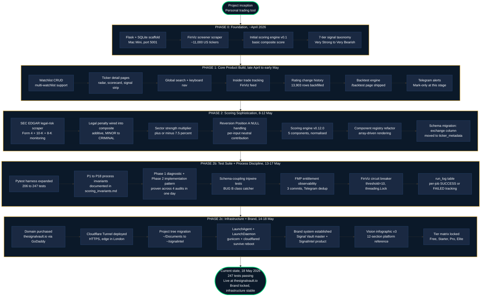

# The Signal Vault: Project History

**From inception to 18 May 2026.**

The journey of building SignalIntel under the Signal Vault parent brand, structured as five distinct phases. Each phase had its own focus, its own constraints, and its own unlock at the end. This is the story of how a personal backtesting script became a multi-product fintech platform.

---

---

## Phase narrative

### Phase 0: Foundation (April 2026)

Personal trading tool, not a product. Flask scaffold on Mac Mini, port 5001. FinViz screener scraper hitting roughly 11,000 US tickers. First composite score formula (v0.1). The 7-tier signal taxonomy was established here, deliberately descriptive (Very Strong, Stable, Bearish) rather than directive (Buy, Hold, Sell) to sidestep FCA regulated-advice territory.

### Phase 1: Core Product Build (late April to early May 2026)

Watchlist CRUD, ticker detail pages, global search, insider trade tracking, rating change history (13,903 historical changes backfilled in one shot), backtest engine, and Telegram alerts wired to Mark's personal bot. The product became usable as a daily trading tool for one user.

### Phase 2: Scoring Sophistication (8 to 12 May 2026)

The composite score got serious. SEC EDGAR legal-risk scraper added with additive penalties from MINOR (-5) through to CRIMINAL (-60). Sector strength multiplier (plus or minus 7.5 percent). Position A NULL handling for the reversion component (per-input neutral contribution rather than penalising missing data). Scoring engine versioned at v0.12.0 with 5 components and normalisation. Component registry refactor moved the ticker page from hardcoded rendering to array-driven, unlocking the Yahoo components 9-16 work that would follow.

### Phase 2b: Test Suite + Process Discipline (13 to 17 May 2026)

The test count grew from 206 to 247. The P1 to P18 process invariants were codified in `docs/scoring_invariants.md` (NULL equals neutral, diagnose before fixing, audit all surfaces not just symptom site, descriptive language only, audit entries must be empirical, and so on). The Phase 1 diagnostic + Phase 2 implementation pattern proved itself, four audits and four implementations in a single day on 17 May without drift. FMP entitlement observability shipped on 18 May, closing an 11-day silent-failure gap on the economic calendar cron.

### Phase 2c: Infrastructure + Brand (14 to 18 May 2026)

Domain purchased, Cloudflare Tunnel deployed, project tree migrated out of `~/Documents/` to bypass macOS TCC restrictions, LaunchAgent and LaunchDaemon configured for reboot survival. Then the brand work: Signal Vault master brand logo, SignalIntel product brand with documented family system extending to four future products (SignalCrypto, SignalForex, SignalCommodities, SignalBonds), and the 12-section vision infographic. Tier matrix locked.

### Current state

247 tests passing, site live over HTTPS at thesignalvault.io, scoring engine at v0.13.0, brand system locked, infrastructure stable. Two beta testers giving feedback. The product is functional and the foundation is laid for the next phase: monetisation, multi-user notifications, and the Yahoo components expansion.
