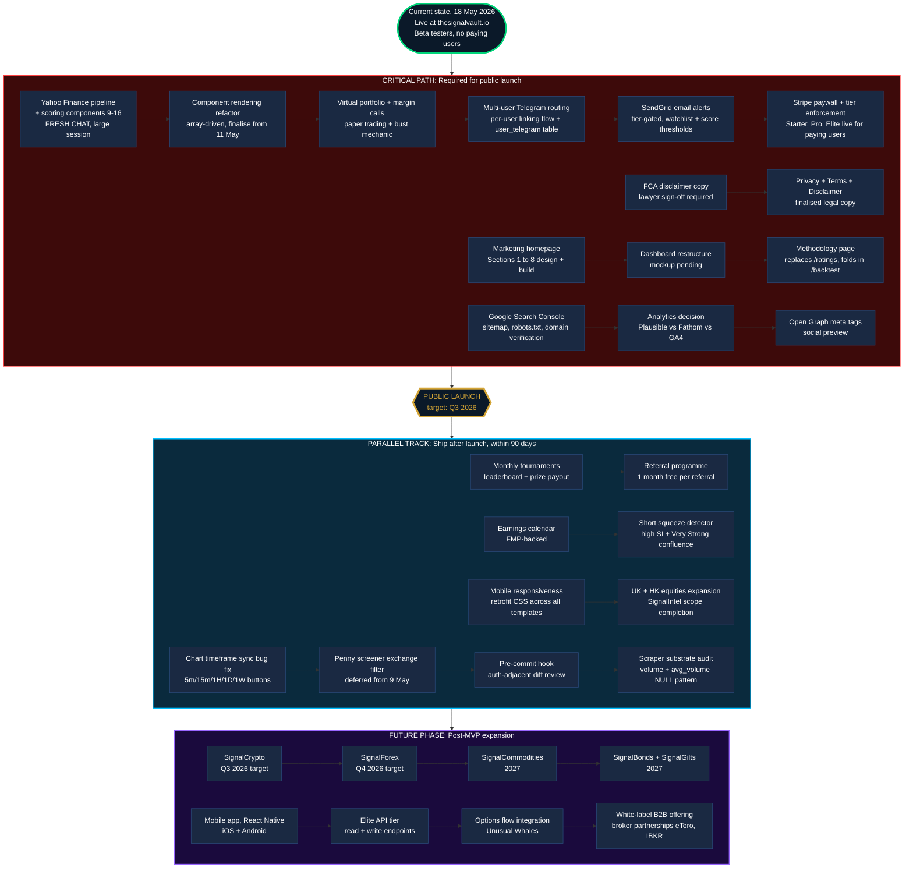

# The Signal Vault: Outstanding Work

**What's left to build, from 18 May 2026 to public launch and beyond.**

Three lanes: critical path (must ship for public launch), parallel track (can ship after launch but soon), and future phase (post-MVP). The critical path is the launch blocker; everything else can wait.

---

---

## Lane breakdown

### Critical path: required for public launch

This is the launch blocker. Nothing in here is optional if the goal is "paying users on a stable product." Roughly 14 distinct workstreams, several of which are multi-session.

**Technical workstreams:**
- Yahoo Finance pipeline (components 9 to 16): fresh chat, large infrastructure session. This is the single biggest pending technical lift.
- Component rendering refactor: must land before or alongside Yahoo components to avoid bloating the ticker page hardcode.
- Virtual portfolio with margin calls and bust mechanic: the headline feature for tournaments and engagement.
- Multi-user Telegram routing + SendGrid: notifications substrate. Currently Telegram only fires to Mark's personal bot. Hard blocker for the paywall, half-shipped notifications are worse than no notifications. Estimated 2 to 3 weeks.
- Stripe paywall: tier enforcement live for paying users. Stripe account already connected, just needs wiring.

**Legal + compliance:**
- FCA disclaimer copy, lawyer sign-off required. The bottom-of-page disclaimer on the infographic is a placeholder.
- Privacy + Terms + Disclaimer: drafts on the website, need finalised lawyer-approved copy.

**Marketing + UX:**
- Marketing homepage Sections 1 to 8: design pass partially done, build pending.
- Dashboard restructure: mockup pending, then per-page CC implementation.
- Methodology page: replaces /ratings, folds in /backtest as a tab.

**Launch operations:**
- Google Search Console indexing, sitemap, robots.txt, domain verification.
- Analytics decision: Plausible / Fathom / GA4. Privacy-friendly fits transparency-first brand positioning.
- Open Graph meta tags for social preview cards.

### Parallel track: ship after launch, within 90 days

These add to the product but don't block launch. Once the paywall is live and the first users are paying, these become the post-launch sprint backlog.

- Monthly tournaments and referral programme (the engagement loop)
- Earnings calendar and short squeeze detector (feature expansion)
- UK and HK equities (completing SignalIntel's stated scope)
- Mobile responsiveness retrofit (currently desktop-only)
- Chart timeframe sync bug, penny screener exchange filter, pre-commit hook, scraper substrate audit (debt cleanup)

### Future phase: post-MVP expansion

The Signal Vault product family beyond SignalIntel. These are timeline commitments made on the infographic, not work that should be started before SignalIntel is generating revenue.

- SignalCrypto (Q3 2026 target)
- SignalForex (Q4 2026 target)
- SignalCommodities (2027)
- SignalBonds + SignalGilts (2027)
- Mobile app, React Native (post-web launch)
- Elite API tier with read and write endpoints
- Options flow integration (Unusual Whales)
- White-label B2B and broker partnerships (eToro, IBKR)

---

## Honest read on critical-path velocity

Fourteen workstreams on the critical path. At Mark's current pace (roughly one major feature per week, plus continuous test + infrastructure work), that's a 12 to 16 week runway to launch if everything goes smoothly. Realistically with unknown unknowns (lawyer turnaround, Stripe tax setup edge cases, Yahoo pipeline surprises), allow 4 to 6 months from 18 May 2026. **Target public launch window: late September to mid November 2026.**

Two highest-leverage items to prioritise:
1. **Lawyer enquiry sent**. Without FCA clarity, the entire product positioning is built on uncertain foundations. Longest lead time of anything on the list.
2. **Yahoo Finance pipeline**. Largest single technical lift, gates the rest of the scoring engine maturity.

Everything else can sequence after those two are unblocked.
